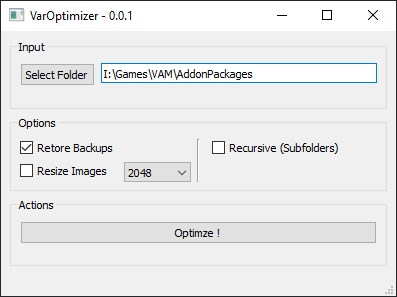

VAM Optimizer
---
A tool to optimize .var files for virtamate by converting The Textures inside of the .var Archives

Features:
- Backing up .var Files inside folders
- Rescaling images to a desired Maximum Resolution from 128x128 to 4096x4096
- Recursive Operation of Nested AddonDirectories

